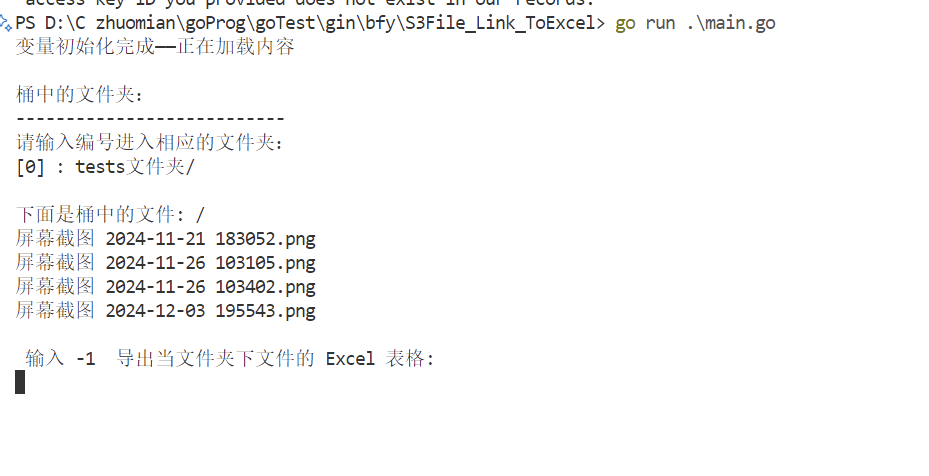
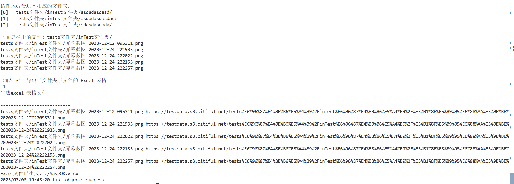
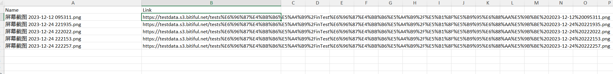

# S3File_Link_ToExcel
**适用于bitiful 对象存储系统的文件访问    基于bitiful官方SDK 开发  将文件名称和文件公开连接和文件导出到Excel表格**

## 构建方法 

如果你电脑拥有 go 环境或者你是一个 gopher  环境配置正确 构建就会很简单

```bash
go build main.go
```

或者直接运行 

```bash
go run main.go
```

## 使用方法

我只 提供了 在windows 下的 构建的 windows 文件 

- 创建配置文件config.yml 

  ```yaml
  access_key: "YOUR_ACCESS_KEY_HERE"
  # 
  secret_key: "YOUR_SECRET_KEY_HERE"
  # 要访问的桶名称
  bucket_name: "your-bucket-name"
  ```

- 打开main.exe 直接运行就可以

- 如果配置文件 没问题 并且 bitiful 是 公开连接 可以访问到的情况 可以打开该程序

## 效果展示

没有界面的 文件列表





**输入 编号就可以进入相应的文件夹  并列出相应的文件夹内容**

**输入 -1 就会将文件夹下的文件导出到Excel 表格** 

| 文件名称 | 文件链接 |
| :------: | :------: |
| fileName | FileLink |





